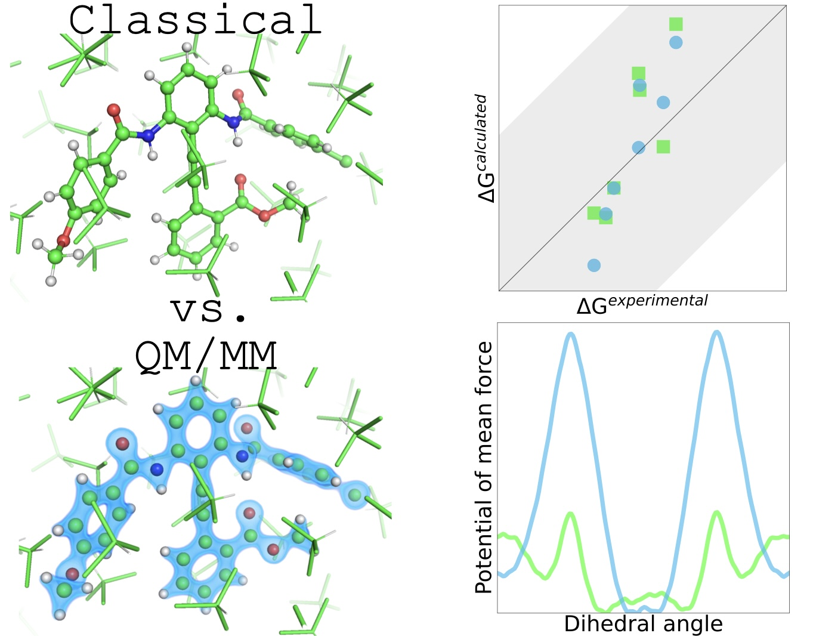

# Molecular balances
How Well Do Classical and Multiscale QM/MM Molecular Dynamics Simulations Capture Stereoelectronic Effects? A Comparative Study on Atropisomerism

## Publications

- Preprint on [ChemRxiv](https://doi.org/)

## Abstract
Subtle stereoelectronic effects can play an important role in drug discovery and other application areas, with atropisomerism gaining increasing interest recently. This raises the question which level of theory is required to model such phenomena accurately by computational means, i.e. are classical mechanics (MM) with a fixed-charge force field sufficient or is a quantum-mechanical (QM) treatment needed. Here, the ability of classical and multiscale (QM/MM) molecular dynamics simulations to capture these effects is assessed by calculating free-energy differences between the conformational states of a series of molecular balances. Significantly different free-energy profiles are obtained and the differences are rationalized via a detailed geometric characterization and force-field investigation, pointing towards limitations of the classical fixed-point-charge approximation. Interestingly, despite these differences, the calculated free-energy differences are within chemical accuracy for all considered methods, with QM/MM providing better relative ranking of the compounds.

## Description

This repository contains input files required to reproduce this work in the input_files folder and an example analysis in the analysis folder.

## Author

Domen Pregeljc ([@dpregeljc](https://github.com/dpregeljc))
